# Remote Sensing Lab — Land Cover Classification with ENVI

**Remote Sensing course — Lab Report**
Fereshteh Sabeghi Eskandar — 333840
Università degli Studi di Torino
2024

---

## Indice

1. [Introduzione](#introduzione)
2. [Acquisizione dei dati](#1-acquisizione-dei-dati)
3. [Region of Interest (ROI) e false color image](#2-region-of-interest-roi-e-false-color-image)
4. [Raster color slice](#3-raster-color-slice)
5. [Scatter plot](#4-scatter-plot)
6. [Band math](#5-band-math)
7. [Spectral indices (NDVI)](#6-spectral-indices-ndvi)
8. [ROI separability report](#7-roi-separability-report)
9. [Classificazione](#8-classificazione)
10. [Risultato finale](#9-risultato-finale)
11. [Materiali del repository](#materiali-del-repository)

---

## Introduzione

Questo progetto utilizza le tecnologie di telerilevamento, in particolare il software **ENVI**, per classificare e analizzare diverse tipologie di copertura del suolo (*land cover*) a partire da un'immagine satellitare. Il telerilevamento permette di estrarre informazioni preziose da immagini satellitari, migliorando il monitoraggio e la gestione di ambienti naturali e urbani.

Le categorie di copertura del suolo identificate e mappate sono:

1. **Corpi d'acqua** (Water Bodies)
2. **Aree urbane** (Urban Areas / Building)
3. **Terreni agricoli** (Agricultural Land / Crop Lands)
4. **Aree montuose** (Mountainous Regions)

Le tecniche di elaborazione delle immagini applicate includono:

- **Density Slicing** — distinzione tra diverse coperture del suolo in base alla risposta spettrale
- **Scatter Plot Analysis** — analisi di combinazioni di bande spettrali per separare visivamente le categorie
- **Band Math** — operazioni matematiche tra bande per migliorare l'accuratezza della classificazione
- **Spectral Indexes** — indici come NDVI (Normalized Difference Vegetation Index) per evidenziare vegetazione e corpi d'acqua
- **Classification Algorithms** — metodi di classificazione supervisionata e non supervisionata

---

## 1. Acquisizione dei dati

I dati satellitari sono stati ottenuti tramite il **Copernicus Browser**, selezionando un'area di interesse di circa 183 km² nella regione di Tabriz (Iran), con immagini **Sentinel-2** (missione SENTINEL-2, strumento MSI, livello L1C).

<p align="center">
  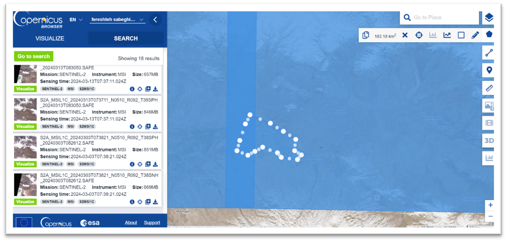
</p>

<p align="center"><em>Figura 1 — Interfaccia di ricerca Copernicus Browser: selezione dell'area di interesse e dei prodotti Sentinel-2 disponibili (marzo 2024).</em></p>

I dati sono stati poi importati in **ENVI** tramite il percorso *Open As → European Space Agency → Sentinel-2*.

<p align="center">
  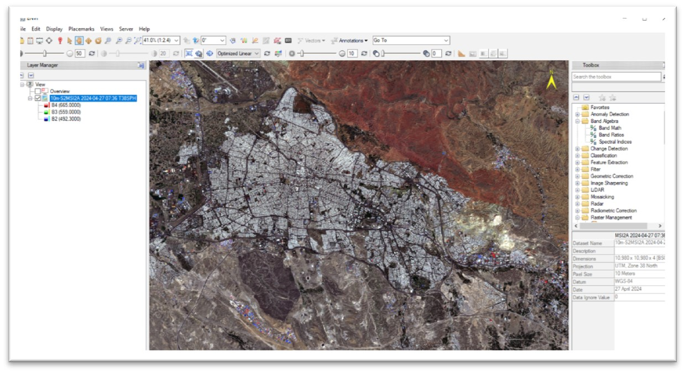
</p>

<p align="center"><em>Figura 2 — Visualizzazione dell'immagine Sentinel-2 (10m, T38SPH, aprile 2024) in ENVI, bande B4-B3-B2 (RGB naturale).</em></p>

---

## 2. Region of Interest (ROI) e false color image

Dopo l'apertura dei dati, è stata definita la **Region of Interest (ROI)**: un campione selezionato dell'immagine raster (es. aree d'acqua o specifiche tipologie di copertura del suolo).

### False color image

Una *false color image* viene creata combinando misure di intensità di lunghezze d'onda, sia visibili che non visibili all'occhio umano. A differenza delle immagini a colori reali, le immagini in falsi colori utilizzano almeno una lunghezza d'onda non visibile, rivelando caratteristiche altrimenti difficili da distinguere.

<p align="center">
  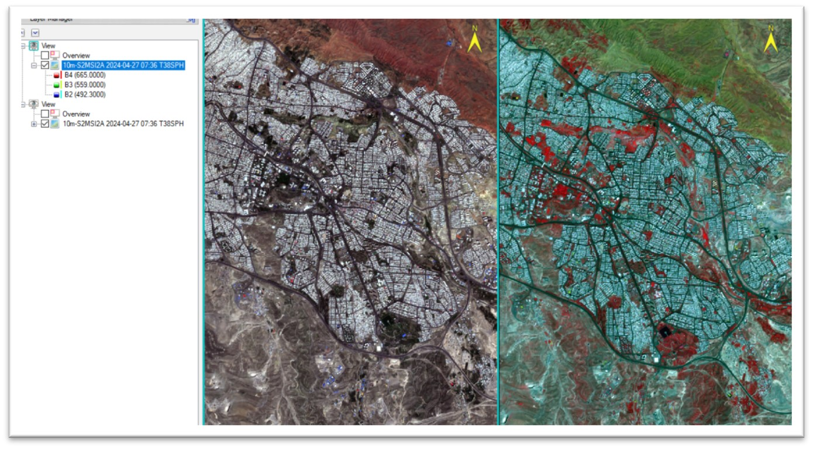
</p>

<p align="center"><em>Figura 3 — Confronto tra composito a colori naturali (sinistra) e falso colore (destra): la vegetazione appare in rosso, evidenziando le aree verdi altrimenti poco distinguibili.</em></p>

### Definizione delle ROI per categoria

Per ciascuna categoria di copertura del suolo sono state definite ROI di campionamento, analizzandone la firma spettrale (Min/Max/Mean) attraverso le bande disponibili (492–833 nm):

<p align="center">
  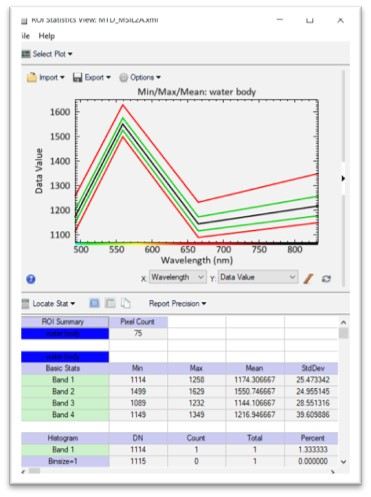
  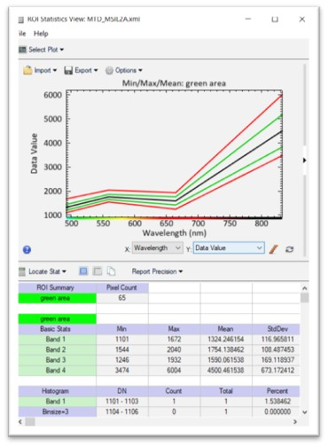
</p>

<p align="center"><em>Figura 4 — Firme spettrali Min/Max/Mean per le ROI "water body" (sinistra) e "green area" (destra). Si noti il picco di riflettanza dell'acqua intorno a 550 nm e la crescita marcata della riflettanza della vegetazione nell'infrarosso vicino.</em></p>

Lo stesso procedimento è stato applicato per le categorie *building* (edificato) e *crop lands* (terreni agricoli), e per la categoria *mountains* (aree montuose), ciascuna con una firma spettrale distintiva utile alla successiva classificazione.

---

## 3. Raster color slice

Il **Raster Color Slice** è una tecnica per evidenziare visivamente specifici intervalli di valori all'interno di un'immagine raster, permettendo di esplorare la distribuzione dei valori dei pixel e identificare aree con caratteristiche simili.

Il procedimento prevede tre fasi:
- **Data Range Selection** — selezione di una banda e definizione di un intervallo minimo/massimo ("slice")
- **Color Mapping** — ENVI assegna un colore specifico a quell'intervallo di valori
- **Visualization** — i pixel nell'intervallo vengono visualizzati nel colore scelto

### Esempio: raster color slice per i corpi d'acqua

<p align="center">
  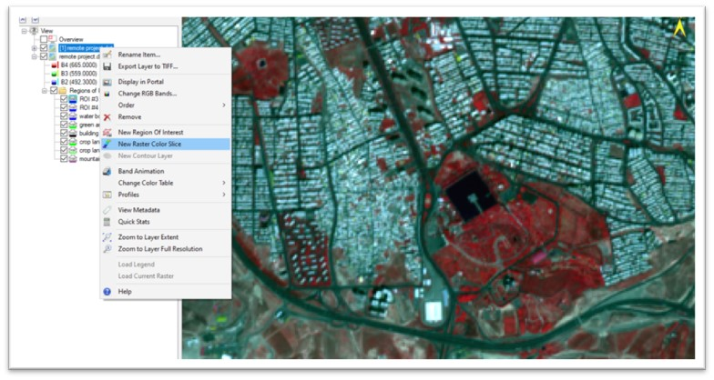
</p>

<p align="center"><em>Figura 5 — Creazione di un nuovo Raster Color Slice tramite menu contestuale in ENVI, a partire da un layer e dalle ROI definite.</em></p>

L'istogramma della banda 8 (B8) permette di isolare l'intervallo di valori corrispondente al corpo d'acqua individuato (il bacino visibile in blu nell'immagine, sopra l'area urbana):

<p align="center">
  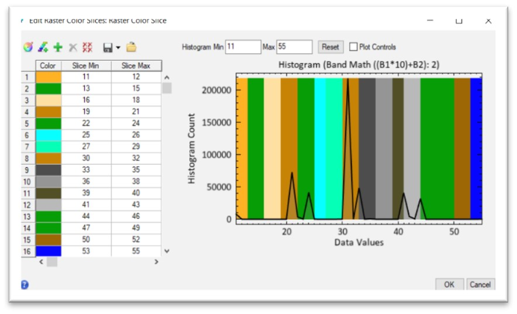
</p>

<p align="center"><em>Figura 6 — Editor "Raster Color Slice" con istogramma della Banda Math ((B1*10)+B2): la classificazione multiclasse finale (6 classi) è ottenuta combinando le bande risultanti dai passaggi precedenti.</em></p>

### Raster color slice per le aree verdi

<p align="center">
  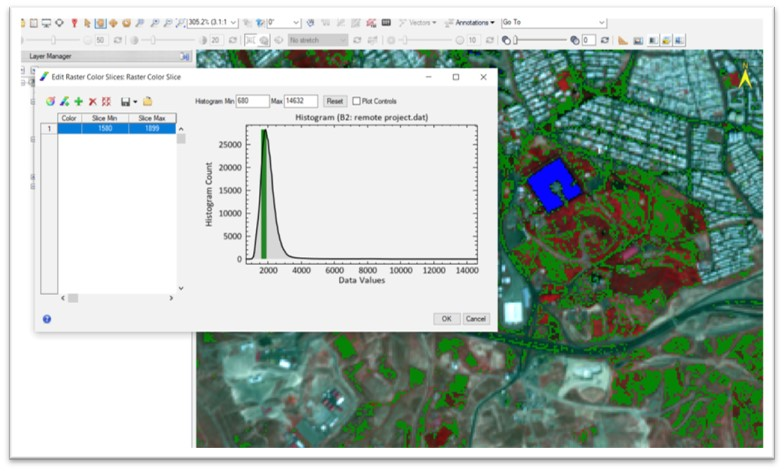
</p>

<p align="center"><em>Figura 7 — Raster Color Slice applicato alla Banda 2 per isolare le aree verdi (intervallo 1580–1899), sovrapposto al composito falso colore.</em></p>

---

## 4. Scatter plot

Lo **scatter plot** è uno strumento grafico per visualizzare la relazione tra due variabili. In ENVI permette di esplorare come i valori di una banda corrispondano ai valori di un'altra banda:

- **Band Selection** — scelta di due bande da confrontare (diverse lunghezze d'onda)
- **Data Visualization** — ogni pixel è rappresentato come un punto, con asse X e Y corrispondenti rispettivamente alla prima e seconda banda scelta
- **Identifying Relationships** — l'osservazione della distribuzione dei punti rivela correlazioni positive, negative, o l'assenza di relazione tra le bande

<p align="center">
  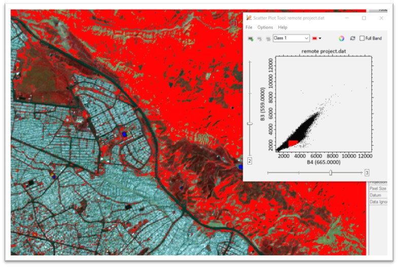
</p>

<p align="center"><em>Figura 8 — Scatter Plot Tool: relazione tra Banda 3 (559 nm) e Banda 4 (665 nm) per la classe "mountains", con selezione interattiva del cluster di pixel corrispondente.</em></p>

---

## 5. Band math

ENVI offre lo strumento **Band Math**, che permette di eseguire calcoli utilizzando le informazioni di diverse bande all'interno dei dati immagine, creando di fatto nuove immagini attraverso la manipolazione dei dati esistenti.

**Output:** il risultato di un'espressione di band math è una nuova immagine con le stesse dimensioni spaziali dell'originale; è possibile definire il tipo di dato (intero, floating-point) e il nome dell'immagine di output.

<p align="center">
  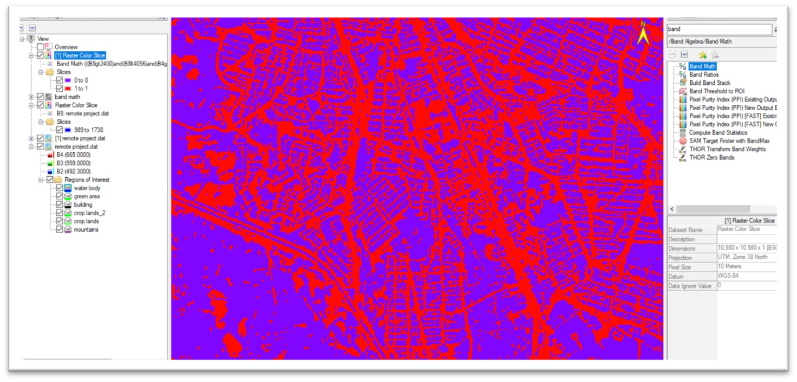
</p>

<p align="center"><em>Figura 9 — Risultato di un'espressione Band Math che combina soglie su più bande (((B8&gt;2400) and (B8&lt;4056) and (B4&gt;1800) and (B4&lt;3500)), generando una classificazione binaria (viola/rosso) dell'area urbana rispetto al resto del territorio.</em></p>

---

## 6. Spectral indices (NDVI)

Gli **indici spettrali** sono formule matematiche applicate a dati multispettrali o iperspettrali per enfatizzare specifiche caratteristiche o materiali, sfruttando le proprietà di riflettanza spettrale unica dei diversi materiali. Combinando bande con pattern di riflettanza contrastanti, questi indici evidenziano le caratteristiche di interesse e sopprimono le informazioni di sfondo.

### Difference Vegetation Index

<p align="center">
  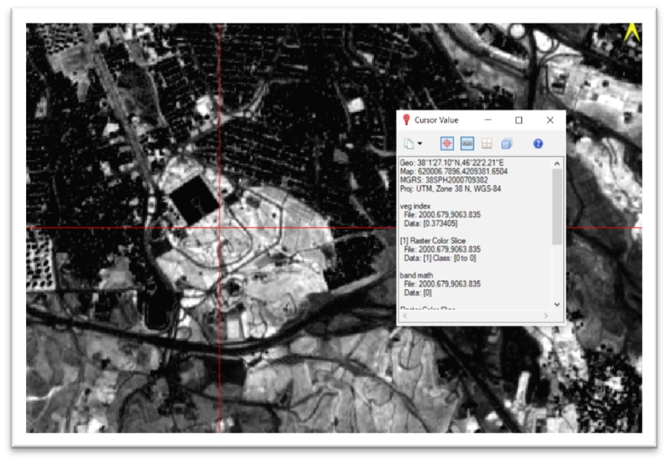
</p>

<p align="center"><em>Figura 10 — Lettura del valore puntuale dell'indice di vegetazione tramite lo strumento "Cursor Value" in ENVI, con coordinate geografiche e classe associata.</em></p>

### NDVI — Normalized Difference Vegetation Index

<p align="center">
  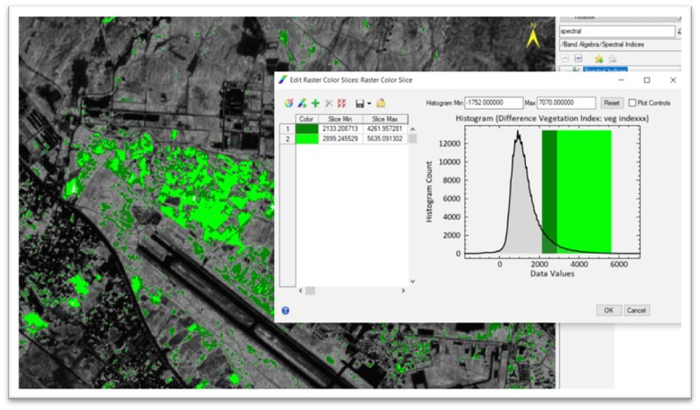
</p>

<p align="center"><em>Figura 11 — Strumento "Spectral Indices" di ENVI per il calcolo del Green Normalized Difference Vegetation Index, con relativo Raster Color Slice che isola le aree a maggiore densità vegetativa (in verde) lungo i corsi d'acqua e i terreni coltivati.</em></p>

---

## 7. ROI separability report

Il **ROI Separability Report** è un output chiave generato da software di elaborazione immagini come ENVI, per valutare la qualità delle ROI scelte in vista di compiti successivi come la classificazione.

Il report fornisce:
- **ROI Names** — etichette delle ROI definite
- **Separability Measure** — misura quantitativa di separabilità tra ogni coppia di ROI (Jeffries-Matusita, Transformed Divergence)
- **Separation Ranking** — classifica delle coppie di ROI in base alla loro separabilità

<p align="center">
  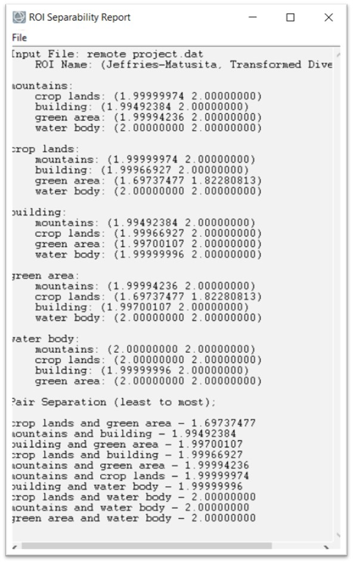
</p>

<p align="center"><em>Figura 12 — ROI Separability Report: la coppia "crop lands" e "green area" risulta la meno separabile (1.697), segnalando una possibile sovrapposizione spettrale tra queste due classi nella classificazione finale.</em></p>

| Coppia ROI | Separabilità |
|---|---|
| crop lands ↔ green area | 1.697 (meno separabile) |
| mountains ↔ building | 1.995 |
| building ↔ green area | 1.997 |
| crop lands ↔ building | 1.9997 |
| mountains ↔ green area | 1.9999 |
| mountains ↔ crop lands | 1.99999 |
| building ↔ water body | 1.99999996 |
| crop lands ↔ water body | 2.000 (massima separabilità) |
| mountains ↔ water body | 2.000 |
| green area ↔ water body | 2.000 |

---

## 8. Classificazione

Sono stati applicati metodi di classificazione **supervisionata** e **non supervisionata**:

- **Supervised Learning** — algoritmi come alberi decisionali e reti neurali, addestrati su dati etichettati
- **Unsupervised Learning** — clustering senza etichette (es. k-means)

### Spectral Angle Mapper (SAM)

Algoritmo che confronta il vettore spettrale di ciascun pixel con i vettori degli *endmember* (le firme spettrali di riferimento delle ROI), classificando in base alla corrispondenza più vicina.

Il flusso di lavoro completo include:
- **Calibration** — correzione del rumore del sensore e degli effetti atmosferici
- **Georeferencing** — allineamento dell'immagine alle coordinate geografiche
- **Spectral Mapping (SAM)** — confronto pixel-endmember
- **Maximum Likelihood** — metodo statistico ampiamente usato per classificare i pixel in categorie di copertura del suolo
- **Classification** — assegnazione finale dei pixel alle classi

<p align="center">
  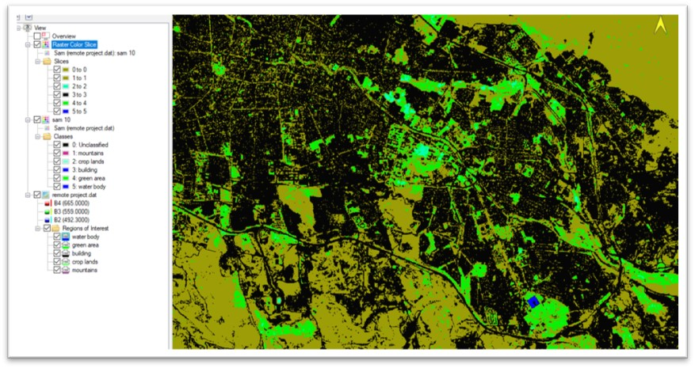
</p>

<p align="center"><em>Figura 13 — Risultato della classificazione Spectral Angle Mapper (SAM) con le 5 classi definite (mountains, crop lands, building, green area, water body), sovrapposto al raster color slice.</em></p>

### Maximum Likelihood Classification

Tecnica di classificazione supervisionata che assegna ogni pixel alla classe con la probabilità statistica più alta di appartenenza, basandosi sulle firme spettrali delle ROI. È particolarmente robusta e adatta a dataset eterogenei.

I parametri di classificazione includono tutte le 5 classi definite (mountains, crop lands, building, green area, water body), con soglia di probabilità impostabile e fattore di scala dei dati.

---

## 9. Risultato finale

Combinando i risultati della classificazione Maximum Likelihood con quelli della Spectral Angle Mapper tramite **Band Math** ((B1\*10)+B2), si ottiene una classificazione finale a 16 classi che integra l'informazione di entrambi i metodi, visualizzata tramite Raster Color Slice con tavolozza colori dedicata:

<p align="center">
  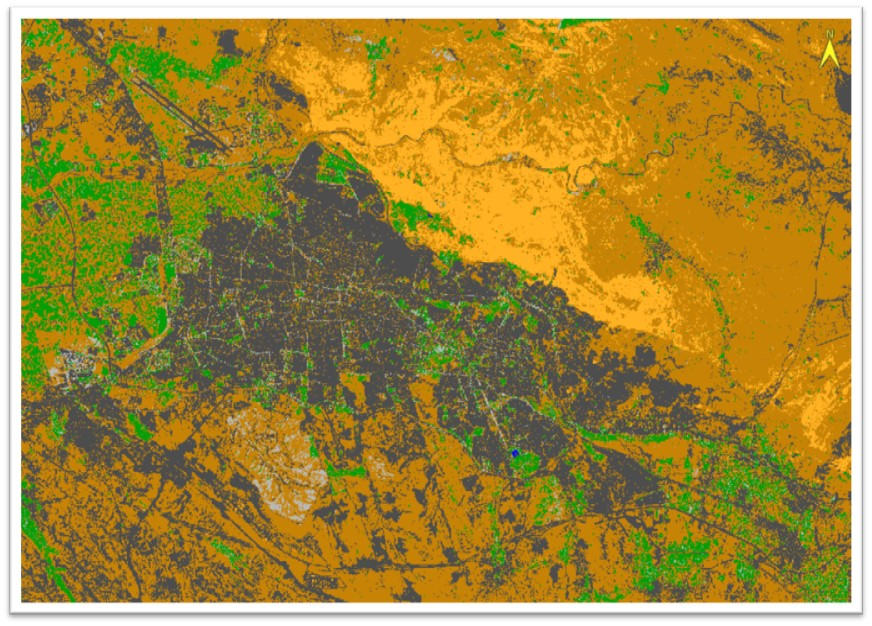
</p>

<p align="center"><em>Figura 14 — Mappa finale di classificazione del land cover dell'area di studio (regione di Tabriz, Iran): in arancione le aree montuose, in grigio scuro l'area urbana, in verde la vegetazione/aree agricole, in blu il corpo d'acqua identificato.</em></p>

La mappa finale distingue chiaramente:
- **Area urbana densa** (grigio scuro) — il tessuto urbano di Tabriz, ben delimitato
- **Aree montuose** (arancione) — a nord-est e ai margini meridionali dell'area
- **Vegetazione/terreni agricoli** (verde) — distribuiti perifericamente intorno al nucleo urbano e lungo il corso d'acqua
- **Corpo d'acqua** (blu) — identificato puntualmente nel settore centro-meridionale

---

## Materiali del repository

```
.
├── README.md
├── docs/
│   └── remote_sensing.pdf                       # Report completo originale
└── images/
    ├── 01_raster_color_slice_classes.jpg         # Classificazione SAM a 5 classi
    ├── 02_final_classification_result.jpg        # Mappa di classificazione finale
    ├── 03_band_math_histogram_editor.jpg         # Editor istogramma multiclasse
    ├── 04_copernicus_data_search.jpg              # Ricerca dati Copernicus Browser
    ├── 05_envi_open_data.jpg                      # Apertura dati Sentinel-2 in ENVI
    ├── 06_false_color_composite.jpg               # Confronto colori naturali/falsi colori
    ├── 07_roi_context_menu.jpg                    # Menu creazione Raster Color Slice
    ├── 08_roi_stats_water_body.jpg                # Firma spettrale ROI "water body"
    ├── 09_roi_stats_green_area.jpg                # Firma spettrale ROI "green area"
    ├── 10_raster_color_slice_editor_green.jpg     # Raster color slice aree verdi
    ├── 11_scatter_plot_mountains.jpg              # Scatter plot classe "mountains"
    ├── 12_band_math_classification.jpg            # Classificazione binaria da band math
    ├── 13_cursor_value_veg_index.jpg               # Lettura puntuale indice di vegetazione
    ├── 14_ndvi_raster_color_slice.jpg              # Calcolo e visualizzazione NDVI
    └── 15_roi_separability_report.jpg              # Report di separabilità delle ROI
```

**Software utilizzato:** ENVI (image processing), Copernicus Browser (acquisizione dati Sentinel-2)
**Dataset:** Sentinel-2 MSI L1C, risoluzione 10 m, area di studio ~183 km² (regione di Tabriz, Iran), aprile 2024

---

## License

Academic coursework produced for the *Remote Sensing* course, Università degli Studi di Torino, 2024. Shared for portfolio and educational purposes.
